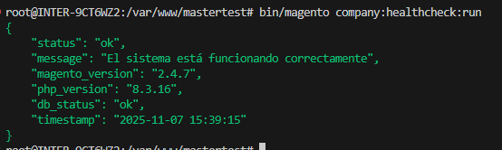
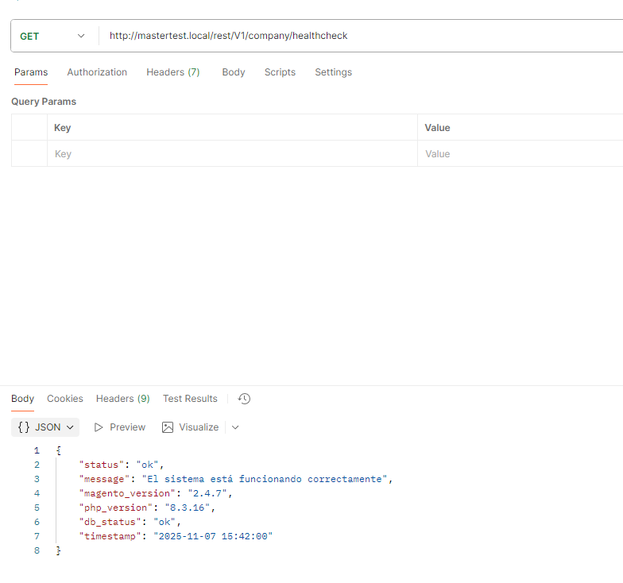
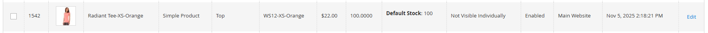
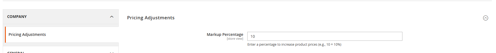
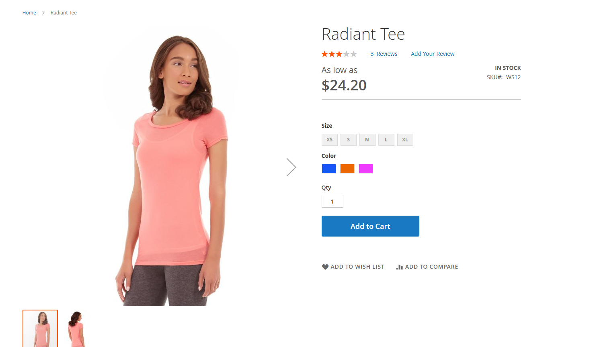

# Company Modules for Magento 2

## 📦 Módulos Incluidos
Este repositorio contiene los siguientes módulos personalizados para **Magento 2.4.7**:

1. **Company_HealthCheck**  
   - Proporciona un endpoint de verificación de salud del sistema.  
   - Permite verificar la versión de Magento, PHP y la conexión con la base de datos.  
   - Incluye un comando CLI (`bin/magento company:healthcheck:run`).

2. **Company_PricingAdjust**  
   - Permite aplicar un **incremento porcentual** sobre los precios de los productos.  
   - Añade una configuración en `Stores > Configuration > Company > Pricing Adjustments` con el campo:  
     - `Markup Percentage`: porcentaje a aplicar sobre el precio base de los productos.  
   - Utiliza un plugin sobre `Magento\Catalog\Model\Product::getPrice()` para modificar dinámicamente el precio.

---

## 🧱 Requisitos
- Magento Open Source o Adobe Commerce **2.4.7**
- PHP 8.2+
- MySQL 8.0+
- Composer

---

## ⚙️ Instalación

1. Asegúrate de tener un entorno Magento 2.4.7 funcionando (local o en contenedor).  
   Puedes usar WSL2, Docker o un stack LAMP/LEMP.

2. Copia las carpetas del repositorio dentro del directorio de Magento:

    app/code/Company/HealthCheck

    app/code/Company/PricingAdjust


3. Ejecuta los comandos de instalación:
```bash
bin/magento setup:upgrade
bin/magento setup:di:compile
bin/magento cache:flush
```

## 🧾 Evidencias

Evidencias módulo healthcheck





Evidencias módulo Pricing Adjust

Evidencia valor del producto:



Configuración de markup



Producto con el plugin ajustando el precio final


